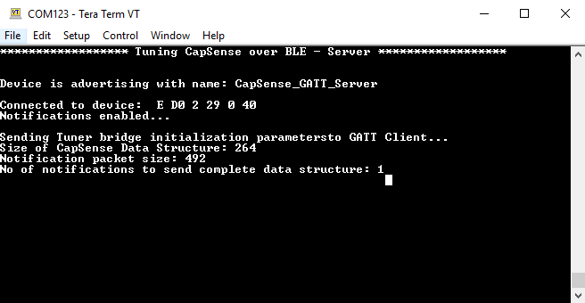
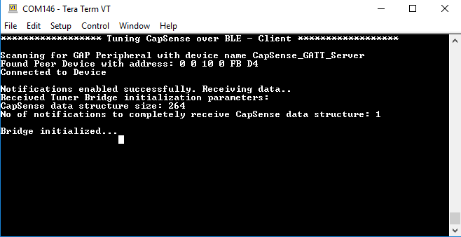

# PSoC 6 MCU: Tuning CapSense Over BLE - Client

This code example demonstrates how to monitor the CapSense® data and tune CapSense sensors over BLE communication with CapSense Tuner GUI using PSoC® 6 BLE.

## Overview

This code example has two applications:

1. **Tuning CapSense Over BLE - Server:** This design has a self-capacitance (CSD)-based 5-segment CapSense slider and two mutual capacitance (CSX)-based CapSense buttons. It has a PSoC 6 BLE MCU configured as a BLE Peripheral and GATT Server that sends CapSense raw data to the GATT Client. This project should be run on a board with CapSense sensors that needs to be tuned over BLE communication.

2. **Tuning CapSense Over BLE - Client:** The design has a PSoC 6 BLE MCU configured as a GATT Client to receive CapSense raw data from a GATT Server. It also has an EZI2C interface to communicate with the CapSense Tuner GUI. This project needs to be run on a board that has BLE capability and has a connection to the CapSense Tuner GUI through the EZI2C interface.

**Note:** This code example shows the BLE GATT Client-side of the example project. See [PSoC 6 MCU: Tuning CapSense Over BLE - Server](https://github.com/cypresssemiconductorco/mtb-example-psoc6-ble-capsense-tuner-server) for the BLE GATT server-side of the project.

**Figure 1. High-level Block Diagram**


## Requirements

- [ModusToolbox® software](https://www.cypress.com/products/modustoolbox-software-environment) v2.2

   **Note:** This code example version requires ModusToolbox software version 2.2 or later and is not backward compatible with v2.1 or older versions. If you cannot move to ModusToolbox v2.2, use the latest compatible version of this example: [latest-v1.X](https://github.com/cypresssemiconductorco/mtb-example-psoc6-ble-capsense-tuner-client/tree/latest-v1.X).

- Board Support Package (BSP) minimum required version: 2.0.0
- Programming Language: C
- Associated Parts: All [PSoC® 6 MCU](http://www.cypress.com/PSoC6) parts

## Supported Toolchains (make variable 'TOOLCHAIN')

- GNU Arm® Embedded Compiler v9.3.1 (GCC_ARM) - Default value of `TOOLCHAIN`
- Arm compiler v6.11 (ARM)
- IAR C/C++ compiler v8.42.2 (IAR)

## Supported Kits (make variable 'TARGET')

### Tuning CapSense Over BLE - Server

- [PSoC 6 BLE Pioneer Kit](https://www.cypress.com/CY8CKIT-062-BLE) (CY8CKIT-062-BLE) - default target

### Tuning CapSense Over BLE - Client

- [PSoC 6 BLE Pioneer Kit](https://www.cypress.com/CY8CKIT-062-BLE) (CY8CKIT-062-BLE) - default target
- [PSoC 6 BLE Prototyping Kit](https://www.cypress.com/CY8CPROTO-063-BLE) (CY8CPROTO-063-BLE)

## Hardware Setup

This example uses the board's default configuration. See the kit user guide to ensure that the board is configured correctly.

Two PSoC 6 BLE boards are required to test this code example: one for the application **Tuning CapSense Over BLE - Server** and another for the application **Tuning CapSense Over BLE - Client**. See [Supported Kits](#supported-kits) for the list of kits supported by each code example.

**Note:** The PSoC 6 BLE Pioneer Kit (CY8CKIT-062-BLE) and the PSoC 6 WiFi-BT Pioneer Kit (CY8CKIT-062-WIFI-BT) ship with KitProg2 installed. The ModusToolbox software requires KitProg3. Before using this code example, make sure that the board is upgraded to KitProg3. The tool and instructions are available in the [Firmware Loader](https://github.com/cypresssemiconductorco/Firmware-loader) GitHub repository. If you do not upgrade, you will see an error like "unable to find CMSIS-DAP device" or "KitProg firmware is out of date".

## Software Setup

Install a terminal emulator if you don't have one. Instructions in this document use [Tera Term](https://ttssh2.osdn.jp/index.html.en).

This example requires no additional software or tools.

## Using the Code Example

### In Eclipse IDE for ModusToolbox:

1. Click the **New Application** link in the **Quick Panel** (or, use **File** > **New** > **ModusToolbox Application**). This launches the [Project Creator](http://www.cypress.com/ModusToolboxProjectCreator) tool.

2. Pick a kit supported by the code example from the list shown in the **Project Creator - Choose Board Support Package (BSP)** dialog.

   When you select a supported kit, the example is reconfigured automatically to work with the kit. To work with a different supported kit later, use the [Library Manager](https://www.cypress.com/ModusToolboxLibraryManager) to choose the BSP for the supported kit. You can use the Library Manager to select or update the BSP and firmware libraries used in this application. To access the Library Manager, click the link from the Quick Panel.

   You can also just start the application creation process again and select a different kit.

   If you want to use the application for a kit not listed here, you may need to update the source files. If the kit does not have the required resources, the application may not work.

3. In the **Project Creator - Select Application** dialog, choose the examples **Tuning CapSense Over BLE - Server** and **Tuning CapSense Over BLE - Client** by enabling the checkbox.

4. Optionally, change the suggested **New Application Name**.

5. Enter the local path in the **Application(s) Root Path** field to indicate where the application needs to be created.

   Applications that can share libraries can be placed in the same root path.

6. Click **Create** to complete the application creation process.

For more details, see the [Eclipse IDE for ModusToolbox User Guide](https://www.cypress.com/MTBEclipseIDEUserGuide) (locally available at *{ModusToolbox install directory}/ide_{version}/docs/mt_ide_user_guide.pdf*).

### In Command-line Interface (CLI):

ModusToolbox provides the Project Creator as both a GUI tool and a command line tool to easily create one or more ModusToolbox applications. See the "Project Creator Tools" section of the [ModusToolbox User Guide](https://www.cypress.com/ModusToolboxUserGuide) for more details.

Alternatively, you can manually create the application using the following steps.

1. Download and unzip this repository onto your local machine, or clone the repository.

2. Open a CLI terminal and navigate to the application folder.

   On Linux and macOS, you can use any terminal application. On Windows, open the **modus-shell** app from the Start menu.

   **Note:** The cloned application contains a default BSP file (*TARGET_xxx.mtb*) in the *deps* folder. Use the [Library Manager](https://www.cypress.com/ModusToolboxLibraryManager) (`make modlibs` command) to select and download a different BSP file, if required. If the selected kit does not have the required resources or is not [supported](#supported-kits-make-variable-target), the application may not work. 

3. Import the required libraries by executing the `make getlibs` command.

4. Repeat steps 1 to 3 for the repository [PSoC 6 MCU: Tuning CapSense Over BLE - Server](https://github.com/cypresssemiconductorco/mtb-example-psoc6-ble-capsense-tuner-server) and place it in the same workspace folder.

Various CLI tools include a `-h` option that prints help information to the terminal screen about that tool. For more details, see the [ModusToolbox User Guide](https://www.cypress.com/ModusToolboxUserGuide) (locally available at *{ModusToolbox install directory}/docs_{version}/mtb_user_guide.pdf*).

### In Third-party IDEs:

1. Follow the instructions from the [CLI](#in-command-line-interface-cli) section to create the application, and import the libraries using the `make getlibs` command.

2. Export the application to a supported IDE using the `make <ide>` command.

    For a list of supported IDEs and more details, see the "Exporting to IDEs" section of the [ModusToolbox User Guide](https://www.cypress.com/ModusToolboxUserGuide) (locally available at *{ModusToolbox install directory}/docs_{version}/mtb_user_guide.pdf*.

3. Follow the instructions displayed in the terminal to create or import the application as an IDE project.

## Operation

### Tuning CapSense Over BLE - Server

See [Supported Kits](#supported-kits-make-variable-target) for the list of kits supported by this code example.

1. Connect the board to your PC using the provided USB cable through the KitProg3 USB connector.

2. Open a terminal program and select the KitProg3 COM port. Set the serial port parameters to 8N1 and 115200 baud.

3. Program the board.

   - **Using Eclipse IDE for ModusToolbox:**

      1. Select the application project **Tuning CapSense Over BLE - Server** in the Project Explorer.

      2. In the **Quick Panel**, scroll down, and click **\<Application Name> Program (KitProg3_MiniProg4)**.

   - **Using CLI:**

     From the terminal, execute the `make program` command to build and program the application using the default toolchain to the default target. You can specify a target and toolchain manually:
      ```
      make program TARGET=<BSP> TOOLCHAIN=<toolchain>
      ```

      Example:
      ```
      make program TARGET=CY8CKIT-062-BLE TOOLCHAIN=GCC_ARM
      ```

4. After programming, the application starts automatically. Confirm that "Tuning CapSense over BLE - Server" is displayed on the UART terminal.

**Figure 2. Terminal Output of GATT Server While Advertising**


### Tuning CapSense Over BLE - Client

See [Supported Kits](#supported-kits-make-variable-target) for the list of kits supported by this project.

1. Connect the board to your PC using the provided USB cable through the KitProg3 USB connector.

2. Open a terminal program and select the KitProg3 COM port. Set the serial port parameters to 8N1 and 115200 baud.

3. Program the board.

   - **Using Eclipse IDE for ModusToolbox:**

      1. Select the application project **Tuning CapSense Over BLE - Client** in the Project Explorer.

      2. In the **Quick Panel**, scroll down, and click **\<Application Name> Program (KitProg3_MiniProg4)**.

   - **Using CLI:**

     From the terminal, execute the `make program` command to build and program the application using the default toolchain to the default target. You can specify a target and toolchain manually:
      ```
      make program TARGET=<BSP> TOOLCHAIN=<toolchain>
      ```

      Example:
      ```
      make program TARGET=CY8CPROTO-063-BLE TOOLCHAIN=GCC_ARM
      ```

4. After programming, the application starts automatically. Confirm that "Tuning CapSense over BLE - Client" is displayed on the UART terminal.

**Figure 3. Terminal Output of GATT Client While Scanning**


### Establishing a BLE Connection

1. Connect both boards to your PC and open the corresponding terminals to view UART messages. If required, reset the board after opening the UART terminal.

2. Observe that USER_LED1 is turned ON in both boards indicating that the BLE connection is established between the two PSoC 6 BLE devices.

3. Verify that the tuner bridge initialization data is sent from the GATT Server to the GATT Client. See Figure 4 and Figure 5.

**Figure 4. Terminal Output of GATT Server**



**Figure 5. Terminal Output of GATT Client**



### Monitoring CapSense Data, Tuning CapSense Parameter, and Measuring SNR using Tuner GUI

1. Select **File** > **Disconnect** and disconnect the UART Terminal connected to the device programmed with **Tuning CapSense over BLE - Client**.

2. Launch the CapSense Tuner for the **Tuning CapSense Over BLE - Server** application. See the **Launch the CapSense Tuner** section of the [CapSense Tuner Guide](https://www.cypress.com/file/504381/download).

3. In CapSense Tuner, click the **Setup Tuner Communication** button. Alternatively, select **Tools** > **Setup Tuner Communication**.

4. Connect to the KitProg of the kit that is programmed with **Tuning CapSense Over BLE - Client**. Check the **I2C** checkbox and set the following values in the port configuration section.
   * *I2C Address* : 8
   * *Sub-address* : 2-Bytes
   * *Speed (kHz)* : 1000

5. Click **Connect**, and then click **Start** to extract the CapSense data. You can see the data rate of the packets in the bottom panel.

6. Touch the sensors on the board that is programmed with **Tuning CapSense Over BLE - Server** and notice the change in the sensor/widget status on **Widget View** tab.

7. Open the **Graph View** tab. Check the sensors in the **Widget Explorer** pane to observe sensor signals in the graph. Touch the sensors and notice the signal change on the **Graph View** tab.

8. Change widget/sensor parameter values as needed, and then click **Apply to Device** to apply the new settings to the device.

   **Note:** The **Apply to device** option requires the CapSense Tuner to be in *Synchronized* mode of operation.

For more details on monitoring CapSense data, tuning CapSense parameter tuning, and measuring SNR, see the CapSense Tuner Guide. See [AN85951 – PSoC 4 and PSoC 6 MCU CapSense Design Guide](https://www.cypress.com/documentation/application-notes/an85951-psoc-4-and-psoc-6-mcu-capsense-design-guide) for more details on selecting the right tuning parameters.

## Debugging

You can debug the example to step through the code. In the IDE, use the **\<Application Name> Debug (KitProg3_MiniProg4)** configuration in the **Quick Panel**. For more details, see the "Program and Debug" section in the [Eclipse IDE for ModusToolbox User Guide](https://www.cypress.com/MTBEclipseIDEUserGuide).

**Note:** **(Only while debugging)** On the CM4 CPU, some code in `main()` may execute before the debugger halts at the beginning of `main()`. This means that some code executes twice - once before the debugger stops execution, and again after the debugger resets the program counter to the beginning of `main()`. See [KBA231071](https://community.cypress.com/docs/DOC-21143) to learn about this and for the workaround.

## Design and Implementation

### Tuning CapSense Over BLE - Server

The design has a PSoC 6 BLE MCU configured as a GAP Peripheral and a GATT Server with the *CapSense_Tuner* custom service. This service has two custom characteristics: *CapSense_DS* and *Tuner_Command*. The *CapSense_DS* characteristic is loaded with the CapSense context structure *cy_capsense_tuner*. The *Tuner_Command* characteristic is used to receive command packets from the GATT Client which were received from CapSense Tuner. This code example supports 2M PHY and Data Length Extension (DLE) features to maximize the throughput.

The design also has a CSD-based, 5-segment CapSense slider and two CSX-based CapSense buttons. The project uses the CapSense middleware. See [ModusToolbox User Guide](https://www.cypress.com/file/504361/download) for more details on selecting a middleware. See [AN85951 – PSoC 4 and PSoC 6 MCU CapSense Design Guide](https://www.cypress.com/documentation/application-notes/an85951-psoc-4-and-psoc-6-mcu-capsense-design-guide) for more details of CapSense features and usage.

#### Firmware Flow

When the kit is powered up, the CapSense and BLE blocks are initialized. The PSoC 6 BLE device is configured as BLE GAP Peripheral and GATT Server. The BLE initialization function initializes the BLE stack and registers the BLE stack event handler (an application-level callback function to process BLE events). The *tuner_send_callback* function (an application-level callback function to facilitate data transmission using BLE) is registered in the CapSense middleware to send the *cy_capsense_tuner* CapSense context structure to the GATT Client.

When the BLE connection to the GATT Client device is successful, USER_LED1 will turn ON.

After a successful BLE connection, the GATT Client enables the notifications of the *CapSense_DS* characteristic using Client Characteristic Configuration Descriptor (CCCD). Once notifications are enabled, tuner bridge initialization parameters such as the size of CapSense context structure and the number of notification packets required to send the complete CapSense context structure are sent to the peer GATT Client device.

The application periodically scans the CapSense buttons for user inputs. The `Cy_CapSense_RunTuner()` function is called periodically in the application program to establish synchronized communication with the CapSense Tuner application. The `Cy_CapSense_RunTuner()` function calls the user-registered callback function `tuner_send_callback` to send the CapSense data structure `cy_capsense_tuner`  to the GATT Client. The `cy_capsense_tuner` structure is sent as notification packets using the *CapSense_DS* characteristic.

When you change the CapSense hardware parameters such as resolution, number of sub-conversions, and so on from the CapSense Tuner GUI, it modifies the CapSense context structure. The GATT Server receives this as a write command through the *Tuner_Command* characteristic. The write command contains the offset address of the CapSense context structure that is modified, actual data modified, and the number of bytes modified by the CapSense Tuner. The application is notified of this event through the BLE stack event handler. The application then modifies the CapSense context structure directly using this information.

**Figure 6. High-level Firmware Flowchart**


#### Resources and Settings

**Table 1. Application Resources**

| Resource  |  Alias/Object     |    Purpose     |
| :------- | :------------    | :------------ |
| BLE | CYBSP_BLE | Establish BLE communication with GATT client |
| CSD | CYBSP_CSD | CapSense driver to interface touch sensors |
| UART (HAL)|cy_retarget_io_uart_obj| UART HAL object used by Retarget-IO for debug UART port  |
| GPIO (HAL)    | CYBSP_USER_LED1         | User LED                  |

### Tuning CapSense Over BLE - Client

The design has a PSoC 6 BLE MCU configured as BLE GAP Central and GATT Client with the *CapSense_Tuner* custom service. The design also uses a serial communication block  (SCB) configured as EZIZC to establish I2C communication with the onboard KitProg, which enables the CapSense Tuner to read the CapSense raw data. The CapSense Tuner is a standalone tool that runs on a PC, and is included in the ModusToolbox software to tune CapSense applications. This code example supports 2M PHY and Data Length Extension (DLE) features to maximize the throughput.

#### Firmware Flow

When the kit is powered up, the BLE and SCB (configured as EZI2C) blocks are initialized. The BLE initialization function initializes the BLE stack and registers the BLE stack event handler (an application-level callback function to process BLE events).

When the BLE connection to the GATT Server device is successful, USER_LED1 will turn ON.

After the BLE connection is established, the notifications are enabled to receive data from the GATT Server using the CCCD handle of the *CapSense_DS* characteristic. Once notifications are enabled, the tuner bridge initialization parameters such as size of CapSense context structure and the number of notification packets required to send the complete CapSense context structure are received from the peer GATT Server device. This is used to set the size of the EZI2C buffer.

When you change the CapSense hardware parameters such as resolution, number of sub-conversions, and so on from the CapSense Tuner GUI, the Tuner GUI modifies the CapSense context structure (EZI2C buffer).

The application does the following:

 * Checks whether a notification event is received from the GATT Server device through the *CapSense_DS* characteristic. Once a notification containing the CapSense context structure is received, it is loaded to the EZI2C buffer to be read by the CapSense Tuner (I2C Master).

 * Checks whether a I2C write event has been triggered by the CapSense Tuner (I2C Master). Once write event is received, the application finds the offset, number of bytes modified, and the data written on the CapSense context structure by the CapSense Tuner. This data is communicated to the peer GATT Server through a GATT write command using the *Tuner_Command* characteristic handle.

 **Figure 7. High-level Firmware Flowchart**

 

 #### Resources and Settings

 **Table 2. Application Resources**

| Resource  |  Alias/Object     |    Purpose     |
| :------- | :------------    | :------------ |
| BLE | CYBSP_BLE | Establish BLE communication with GATT Server |
| SCB | EZI2C | EZI2C driver to interface with CapSense Tuner |
| UART (HAL)|cy_retarget_io_uart_obj| UART HAL object used by Retarget-IO for Debug UART port  |
| GPIO (HAL)    | CYBSP_USER_LED1         | User LED                  |

## Related Resources

| Application Notes                                            |                                                              |
| :----------------------------------------------------------- | :----------------------------------------------------------- |
| [AN228571](https://www.cypress.com/AN228571) – Getting Started with PSoC 6 MCU on ModusToolbox | Describes PSoC 6 MCU devices and how to build your first application with ModusToolbox |
| [AN221774](https://www.cypress.com/AN221774) – Getting Started with PSoC 6 MCU on PSoC Creator | Describes PSoC 6 MCU devices and how to build your first application with PSoC Creator |
| [AN210781](https://www.cypress.com/AN210781) – Getting Started with PSoC 6 MCU with Bluetooth Low Energy (BLE) Connectivity on PSoC Creator | Describes PSoC 6 MCU with BLE Connectivity devices and how to build your first application with PSoC Creator |
| [AN215656](https://www.cypress.com/AN215656) – PSoC 6 MCU: Dual-CPU System Design | Describes the dual-CPU architecture in PSoC 6 MCU, and shows how to build a simple dual-CPU design |
| [AN85951](https://www.cypress.com/AN85951) – PSoC® 4 and PSoC® 6 MCU CapSense® Design Guide  | Describes how to design capacitive touch sensing applications with the PSoC 6 families of devices |
| **Code Examples**                                            |                                                              |
| [Using ModusToolbox](https://github.com/cypresssemiconductorco/Code-Examples-for-ModusToolbox-Software) | [Using PSoC Creator](https://www.cypress.com/documentation/code-examples/psoc-6-mcu-code-examples) |
| **Device Documentation**                                     |                                                              |
| [PSoC 6 MCU Datasheets](https://www.cypress.com/search/all?f[0]=meta_type%3Atechnical_documents&f[1]=resource_meta_type%3A575&f[2]=field_related_products%3A114026) | [PSoC 6 Technical Reference Manuals](https://www.cypress.com/search/all/PSoC%206%20Technical%20Reference%20Manual?f[0]=meta_type%3Atechnical_documents&f[1]=resource_meta_type%3A583) |
| **Development Kits**                                         | Buy at www.cypress.com                                       |
| [CY8CKIT-062-BLE](https://www.cypress.com/CY8CKIT-062-BLE) PSoC 6 BLE Pioneer Kit | [CY8CPROTO-063-BLE](https://www.cypress.com/CY8CPROTO-063-BLE) PSoC 6 BLE Prototyping Kit |
| **Libraries**                                                 |                                                              |
| PSoC 6 Peripheral Driver Library (PDL) and docs  | [mtb-pdl-cat1](https://github.com/cypresssemiconductorco/mtb-pdl-cat1) on GitHub |
| Cypress Hardware Abstraction Layer (HAL) Library and docs     | [mtb-hal-cat1](https://github.com/cypresssemiconductorco/mtb-hal-cat1) on GitHub |
| Retarget IO - A utility library to retarget the standard input/output (STDIO) messages to a UART port | [retarget-io](https://github.com/cypresssemiconductorco/retarget-io) on GitHub |
| **Middleware**                                               |                                                              |
| BLESS library and docs                                       | [bless](https://github.com/cypresssemiconductorco/bless) on GitHub|
| CapSense® library and docs                                    | [capsense](https://github.com/cypresssemiconductorco/capsense) on GitHub |
| Links to all PSoC 6 MCU Middleware                           | [psoc6-middleware](https://github.com/cypresssemiconductorco/psoc6-middleware) on GitHub |
| **Tools**                                                    |                                                              |
| [Eclipse IDE for ModusToolbox](https://www.cypress.com/modustoolbox)     | The cross-platform, Eclipse-based IDE for IoT designers that supports application configuration and development targeting converged MCU and wireless systems.             |
| [PSoC Creator™](https://www.cypress.com/products/psoc-creator-integrated-design-environment-ide) | The Cypress IDE for PSoC and FM0+ MCU development.            |

## Other Resources

Cypress provides a wealth of data at www.cypress.com to help you select the right device, and quickly and effectively integrate it into your design.

For PSoC 6 MCU devices, see [How to Design with PSoC 6 MCU - KBA223067](https://community.cypress.com/docs/DOC-14644) in the Cypress community.

## Document History

Document Title: *CE230229* - *PSoC 6 MCU: Tuning CapSense Over BLE - Client*

| Version | Description of Change |
| ------- | --------------------- |
| 1.0.0   | New code example      |
| 2.0.0   | Major update to support ModusToolbox software v2.2, added support for new kits<br> This version is not backward compatible with ModusToolbox software v2.1  |
------

All other trademarks or registered trademarks referenced herein are the property of their respective owners.


-------------------------------------------------------------------------------

© Cypress Semiconductor Corporation, 2020. This document is the property of Cypress Semiconductor Corporation and its subsidiaries ("Cypress"). This document, including any software or firmware included or referenced in this document ("Software"), is owned by Cypress under the intellectual property laws and treaties of the United States and other countries worldwide. Cypress reserves all rights under such laws and treaties and does not, except as specifically stated in this paragraph, grant any license under its patents, copyrights, trademarks, or other intellectual property rights. If the Software is not accompanied by a license agreement and you do not otherwise have a written agreement with Cypress governing the use of the Software, then Cypress hereby grants you a personal, non-exclusive, nontransferable license (without the right to sublicense) (1) under its copyright rights in the Software (a) for Software provided in source code form, to modify and reproduce the Software solely for use with Cypress hardware products, only internally within your organization, and (b) to distribute the Software in binary code form externally to end users (either directly or indirectly through resellers and distributors), solely for use on Cypress hardware product units, and (2) under those claims of Cypress's patents that are infringed by the Software (as provided by Cypress, unmodified) to make, use, distribute, and import the Software solely for use with Cypress hardware products. Any other use, reproduction, modification, translation, or compilation of the Software is prohibited.  
TO THE EXTENT PERMITTED BY APPLICABLE LAW, CYPRESS MAKES NO WARRANTY OF ANY KIND, EXPRESS OR IMPLIED, WITH REGARD TO THIS DOCUMENT OR ANY SOFTWARE OR ACCOMPANYING HARDWARE, INCLUDING, BUT NOT LIMITED TO, THE IMPLIED WARRANTIES OF MERCHANTABILITY AND FITNESS FOR A PARTICULAR PURPOSE. No computing device can be absolutely secure. Therefore, despite security measures implemented in Cypress hardware or software products, Cypress shall have no liability arising out of any security breach, such as unauthorized access to or use of a Cypress product. CYPRESS DOES NOT REPRESENT, WARRANT, OR GUARANTEE THAT CYPRESS PRODUCTS, OR SYSTEMS CREATED USING CYPRESS PRODUCTS, WILL BE FREE FROM CORRUPTION, ATTACK, VIRUSES, INTERFERENCE, HACKING, DATA LOSS OR THEFT, OR OTHER SECURITY INTRUSION (collectively, "Security Breach"). Cypress disclaims any liability relating to any Security Breach, and you shall and hereby do release Cypress from any claim, damage, or other liability arising from any Security Breach. In addition, the products described in these materials may contain design defects or errors known as errata which may cause the product to deviate from published specifications. To the extent permitted by applicable law, Cypress reserves the right to make changes to this document without further notice. Cypress does not assume any liability arising out of the application or use of any product or circuit described in this document. Any information provided in this document, including any sample design information or programming code, is provided only for reference purposes. It is the responsibility of the user of this document to properly design, program, and test the functionality and safety of any application made of this information and any resulting product. "High-Risk Device" means any device or system whose failure could cause personal injury, death, or property damage. Examples of High-Risk Devices are weapons, nuclear installations, surgical implants, and other medical devices. "Critical Component" means any component of a High-Risk Device whose failure to perform can be reasonably expected to cause, directly or indirectly, the failure of the High-Risk Device, or to affect its safety or effectiveness. Cypress is not liable, in whole or in part, and you shall and hereby do release Cypress from any claim, damage, or other liability arising from any use of a Cypress product as a Critical Component in a High-Risk Device. You shall indemnify and hold Cypress, its directors, officers, employees, agents, affiliates, distributors, and assigns harmless from and against all claims, costs, damages, and expenses, arising out of any claim, including claims for product liability, personal injury or death, or property damage arising from any use of a Cypress product as a Critical Component in a High-Risk Device. Cypress products are not intended or authorized for use as a Critical Component in any High-Risk Device except to the limited extent that (i) Cypress's published data sheet for the product explicitly states Cypress has qualified the product for use in a specific High-Risk Device, or (ii) Cypress has given you advance written authorization to use the product as a Critical Component in the specific High-Risk Device and you have signed a separate indemnification agreement.  
Cypress, the Cypress logo, Spansion, the Spansion logo, and combinations thereof, WICED, PSoC, CapSense, EZ-USB, F-RAM, and Traveo are trademarks or registered trademarks of Cypress in the United States and other countries. For a more complete list of Cypress trademarks, visit cypress.com. Other names and brands may be claimed as property of their respective owners.
